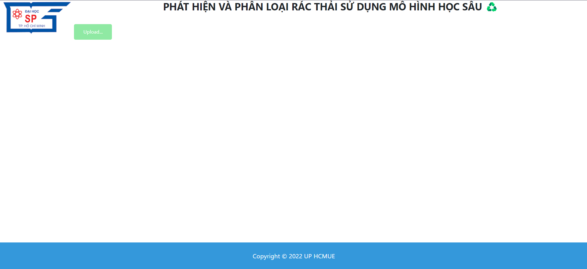
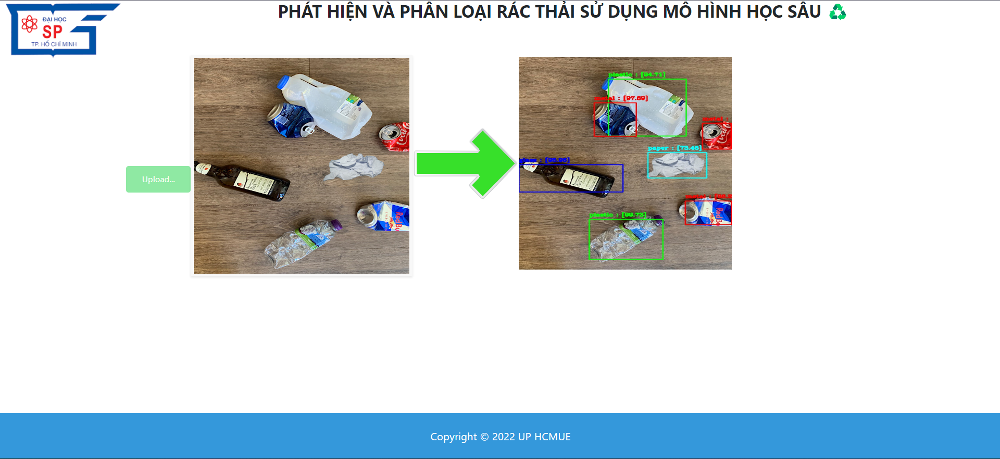

# A REAL TIME APPLICATION FOR WASTE DETECTION AND CLASSIFICATION

## PAPER

Link Paper: [Paper](https://ijarcce.com/wp-content/uploads/2022/05/IJARCCE.2022.11503.pdf)

## DATASET

DRIVE: [Link Download File Weights](https://drive.google.com/file/d/1E01DtUrGSHm_auKYa2UIBy0DdSC36NhO/view?usp=sharing) 


## HOW TO USE
[Link Download File Weights](https://drive.google.com/file/d/1KFt4REEXK4sRZLE21Ihw2hOXdMIcp7AZ/view?usp=sharing)
- Seteup environment (Using Anaconda) Downloand and Install [here](https://docs.conda.io/en/latest/miniconda.html). Then, run the commands.
```
conda crate -n myenv python
conda activate myenv
```
- Run commandlines to install necessary library.
```
conda install requirements.txt
```
-When you done, run bellow to start app.
```
python predict.py
```
## RESULT


<p align="center">Demo image</p>
